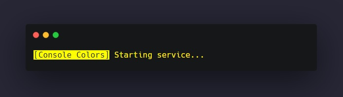
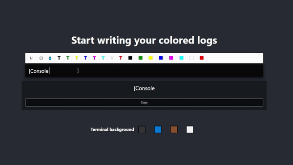

 

<h1>Console Colors</h1>

  
Generate ANSI codes just that easy without any packages; 
Customize terminal background; 
React with Typescript and Draft.js as editor; 
Code not refactored; 
  
# Online version  
https://console-colors.vercel.app/  
  
# Open Source Project  
Clone this project  
Make sure you have Node.js installed (otherwise use online version)  
Run `npm install` or `yarn`  
Run `npm start` or `yarn start`  
  
# How to use  
Inside the center black text block, write your log as you like;  
Customize your text using the buttons above; (U -> underline text, 😀 -> emojis, T -> text colors, ■ -> background text color)  
Copy the result;  